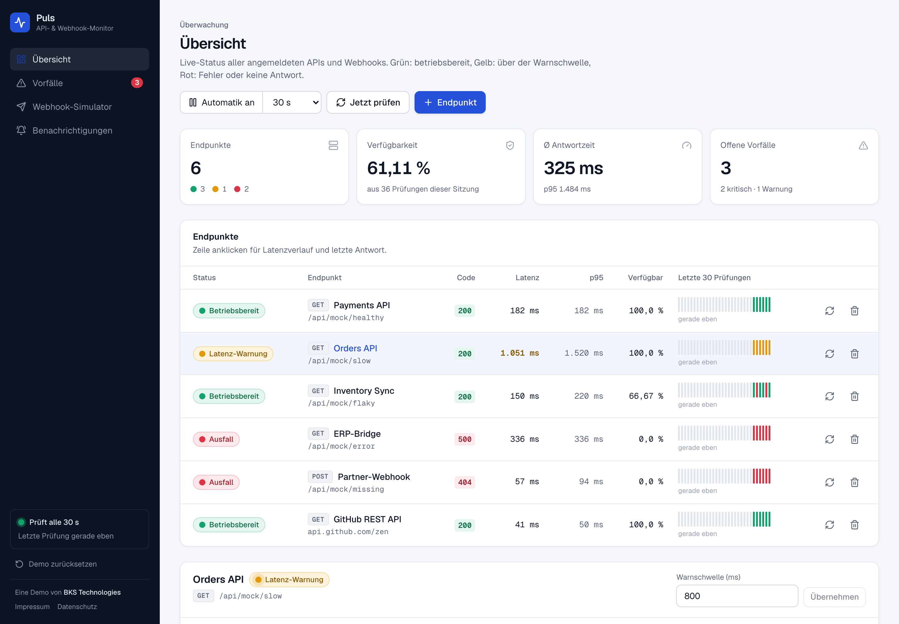
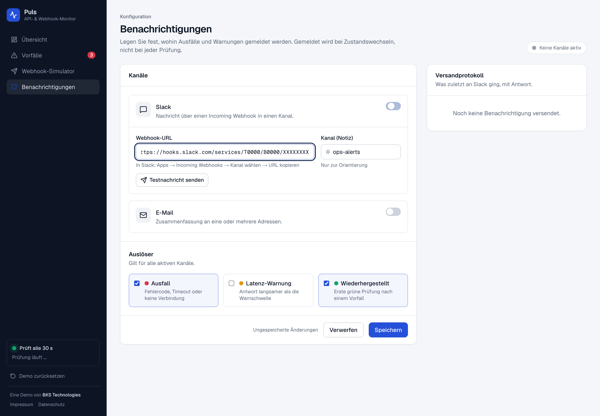
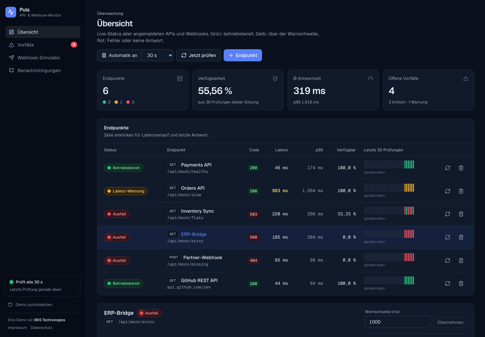

# Puls · API- & Webhook-Monitor

Überwacht APIs und Webhooks: Live-Status je Endpunkt, Latenzverlauf, Vorfall-Protokoll mit Statuscode,
Antwortzeit und Fehler-Body, Webhook-Simulator und Benachrichtigungen über Slack.
Eine Demo von [BKS Technologies](https://bkstechnologies.de).

**[→ Demo öffnen](https://puls.bkstechnologies.de)**: ohne Anmeldung, die Daten bleiben in Ihrem Browser.



| Vorfall im Detail | Webhook-Simulator |
| :---: | :---: |
|  |  |
| **Benachrichtigungen** | **Dunkelmodus** |
|  |  |

## Funktionen

- **Übersicht:** Tabelle aller Endpunkte mit Status (grün = betriebsbereit, gelb = über der Warnschwelle,
  rot = Fehler oder keine Antwort), Statuscode, Latenz, p95, Verfügbarkeit und den letzten 30 Prüfungen.
  Automatische Prüfung alle 15, 30 oder 60 Sekunden.
- **Latenzverlauf** je Endpunkt mit Warnschwelle und markierten Ausreißern, dazu die letzte Antwort im Klartext.
- **Vorfall-Protokoll:** Ein Vorfall öffnet sich beim ersten Fehler, zählt Wiederholungen, eskaliert von Warnung
  zu Ausfall und schließt sich bei der nächsten grünen Prüfung. Detailansicht mit Statuscode, Latenz, Dauer,
  Error-Body, Antwort-Headern, Zeitleiste und „Als cURL kopieren“.
- **Webhook-Simulator:** erzeugte Empfangsadresse, Payload-Vorlagen, JSON-Prüfung mit Zeile und Spalte,
  wählbares Antwortverhalten (202, langsam, 500, 401, 404). Fehlgeschlagene Zustellungen landen im Vorfall-Log.
- **Benachrichtigungen:** Slack über Incoming Webhooks mit Testnachricht und Versandprotokoll,
  E-Mail-Empfänger, Auslöser für Ausfall, Warnung und Wiederherstellung.
- Handy-Ansicht, Dunkelmodus, Tastaturbedienung, reduzierte Bewegung.

## Was echt ist und was simuliert

| Teil | Stand |
| --- | --- |
| Prüfungen | **echt.** `/api/check` ruft jede URL serverseitig auf und misst die Zeit bis zur Antwort. |
| Beispiel-Endpunkte | eingebaute Mocks unter `/api/mock/<szenario>` (stabil, langsam, wackelig, 500, 404, hängt) plus die öffentliche GitHub-API. |
| Webhook-Empfänger | **echt.** `/api/hooks/<id>` antwortet mit 202, 400, 401, 404, 413 oder 500 und speichert nichts. |
| Slack | **echt**, über Incoming Webhooks. Die Nachricht baut der Server aus festen Feldern. |
| E-Mail | nur Konfiguration. Die öffentliche Demo verschickt keine Mails, damit sie kein offener Versandweg ist. |
| Speicher | keine Datenbank. Endpunkte, Verlauf, Vorfälle und Einstellungen liegen im `localStorage` des Besuchers. |

## Sicherheit

Der Prüfdienst ruft URLs im Auftrag anonymer Besucher auf. Er darf deshalb kein Tor ins interne Netz sein (SSRF):

- nur `http` und `https`, keine Zugangsdaten in der URL, relative Pfade nur für `/api/mock/…`
- DNS wird vorab aufgelöst; private, Loopback-, Link-Local-, CGNAT- und Metadaten-Adressen (IPv4 und IPv6) sind gesperrt
- beim Verbindungsaufbau wird **noch einmal** aufgelöst und geprüft (undici-Agent mit eigenem Lookup), damit
  DNS-Rebinding nicht greift
- Weiterleitungen werden nicht verfolgt, Timeout höchstens 10 s, Antwort-Body höchstens 4 KB
- Begrenzung je IP und Instanz: 30 Prüfläufe, 60 Webhooks, 10 Slack-Meldungen pro Minute
- Slack-Ziel nur `https://hooks.slack.com/services/…`
- Sicherheits-Header (`X-Frame-Options`, `nosniff`, HSTS, `Referrer-Policy`, `Permissions-Policy`)

## Technik

Next.js 16 (App Router), React 19, TypeScript, Tailwind CSS 4, Recharts, Lucide, Vitest.

```
app/                      Seiten und API-Routen
components/<bereich>/     UI je Bereich (dashboard, incidents, simulator, alerts, shell)
components/ui/            Grundbausteine (Panel, Button, Felder, Statusanzeigen)
lib/status.ts             Klassifizierung grün/gelb/rot
lib/incidents.ts          Vorfall-Logik als reine Funktion: öffnen, wiederholen, eskalieren, beheben
lib/store.ts              Client-Speicher (useSyncExternalStore + localStorage), Prüftakt, Alarmversand
lib/server/               Prüfung, SSRF-Schutz, Ratenbegrenzung
tests/                    SSRF-Sperre, Statuslogik, Vorfälle, Kennzahlen
```

## Lokal starten

```bash
npm install
npm run dev     # http://localhost:3000
npm test        # 38 Tests
npm run lint
npm run build
```

Keine Umgebungsvariablen nötig. Auf Vercel läuft das Projekt ohne Einstellungen; `vercel.json` setzt die Region
Frankfurt (`fra1`).

---

© BKS Technologies UG (haftungsbeschränkt) · [Impressum](https://puls.bkstechnologies.de/impressum)
